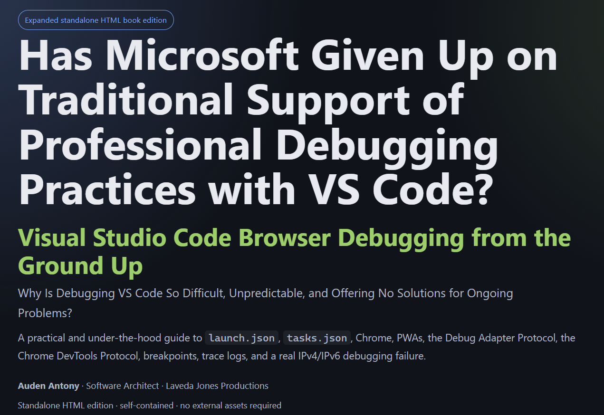

# CloudIDEaaS VSCode Debugger

[](https://marketplace.visualstudio.com/items?itemName=CloudIDEaaS.cloudideaas-vscode-debugger)
[](https://marketplace.visualstudio.com/items?itemName=CloudIDEaaS.cloudideaas-vscode-debugger)
[](https://marketplace.visualstudio.com/items?itemName=CloudIDEaaS.cloudideaas-vscode-debugger)
[](https://marketplace.visualstudio.com/items?itemName=CloudIDEaaS.cloudideaas-vscode-debugger)

A lightweight Visual Studio Code debugger for browser-based JavaScript, TypeScript, and HTML projects.

CloudIDEaaS VSCode Debugger is designed around **convention over configuration**: start debugging from VS Code, launch the local web application and Chrome debugging session, set breakpoints, step through code, and inspect runtime values without relying on `console.log` or constantly switching to browser DevTools.

## Features

- Launch browser debugging directly from Visual Studio Code.
- Starts a local web server for the current workspace.
- Launches Chrome with the Chrome DevTools Protocol (CDP) enabled.
- Supports source breakpoints.
- Supports conditional breakpoints and exception breakpoint configuration.
- Step over, step into, and step out.
- Continue and pause execution.
- View call stacks and scopes.
- Inspect local and object variable values.
- Evaluate expressions while debugging.
- Modify supported variable values.
- View loaded JavaScript sources.
- Handles breakpoint resolution after the application is loaded.
- Editor-title Start Debugging and Stop Debugging buttons.

## Getting Started

Read our free online book on [](https://publications.lavedajones.com/vscode-debugger/index.html)
[https://publications.lavedajones.com/vscode-debugger/index.html](https://publications.lavedajones.com/vscode-debugger/index.html)

for a complete guide to using and understanding the debugger.

Create a VS Code debug configuration using the `cloudideaas-vscode-debugger` debugger type and specify the URL for the page you want to debug.

Example `.vscode/launch.json`:

```json
{
    "version": "0.2.0",
    "configurations": [
        {
            "name": "Chrome Explicit",
            "type": "cloudideaas-vscode-debugger",
            "request": "launch",
            "url": "http://localhost:8000/index.html"
        }
    ]
}
```

Set a breakpoint in your browser-side code and press **F5**, or use the Start Debugging button in the editor title area.

The debugger launches Chrome initially without loading the application, establishes the debugging connection, configures your breakpoints, and then navigates to the requested URL. This allows breakpoints in startup code to be active before the application begins executing.

## Requirements

The initial Marketplace release is intended for **64-bit Windows**.

The extension includes its C# debug adapter and supporting runtime assemblies in the extension package. Chrome must be available on the system for browser debugging.

## Debug Configuration

### `url`

The application URL to launch and debug.

Example:

```json
"url": "http://localhost:8000/index.html"
```

### `port`

Chrome remote-debugging port. The default is `9222`.

Example:

```json
"port": 9222
```

## How It Works

The extension provides the Visual Studio Code integration layer while a C# debug adapter communicates with VS Code using the Debug Adapter Protocol (DAP). The adapter communicates with Chrome using the Chrome DevTools Protocol (CDP).

```text
Visual Studio Code
        |
        | DAP
        v
CloudIDEaaS C# Debug Adapter
        |
        | CDP / WebSocket
        v
      Chrome
```

This architecture allows VS Code breakpoints, stepping, scopes, variables, expression evaluation, and other debugging operations to be translated into Chrome debugging operations.

## Known Limitations

This is an early release and is not intended to duplicate every feature of Microsoft's JavaScript debugger.

Current limitations may include:

- Windows x64 only for the initial release.
- Advanced source-map and bundled-application scenarios may require additional support.
- Multi-target debugging such as workers, multiple tabs, and complex browser target topologies is limited.
- Advanced DAP features such as reverse debugging, instruction breakpoints, data breakpoints, and disassembly are not currently provided.

## Contributing

If you want to contribute but not include dependent projects, change references to Extension\cloudideaas-vscode-debugger\bin\
Also set the following in VSCodeDebugger.csproj to false as such:

<TrimUnusedAssemblies>false</TrimUnusedAssemblies>

You will need to do above steps if you fork.  Otherwise if you want to take advantage of the full solution, let us know and we will help.


## Troubleshooting the Debug Adapter

The extension includes a PowerShell troubleshooting script at:

```text
scripts\Test-DebugAdapter.ps1
```

This script exercises the C# debug adapter directly using the Debug Adapter Protocol (DAP), independently of Visual Studio Code. It can help determine whether a problem is occurring in the packaged debug adapter/runtime or in the Visual Studio Code extension integration.

The simulator performs a basic debugging sequence through launch and shutdown:

```text
initialize
launch
setBreakpoints
setExceptionBreakpoints
configurationDone
disconnect
```

### Finding the Installed Extension Directory

Visual Studio Code normally installs extensions under:

```text
%USERPROFILE%\.vscode\extensions
```

Open that directory in File Explorer, or from PowerShell run:

```powershell
explorer "$env:USERPROFILE\.vscode\extensions"
```

Look for the CloudIDEaaS VSCode Debugger folder. Its name will include the publisher, extension name, version, and may include the target platform, for example:

```text
cloudideaas.cloudideaas-vscode-debugger-0.1.7-win32-x64
```

You can also locate the extension from Visual Studio Code:

1. Open the **Extensions** view.
2. Find **CloudIDEaaS VSCode Debugger** under installed extensions.
3. Open the extension's gear/menu.
4. Choose **Open Extension Folder** if that option is available.

Once you have located the installed extension directory, open PowerShell in that directory. You should see folders such as `bin`, `dist`, `resources`, and `scripts`.

### Running the Troubleshooting Script

From the installed extension directory, run:

```powershell
.\scripts\Test-DebugAdapter.ps1 `
    -DebuggerPath ".\bin\VSCodeDebugger.exe" `
    -Url "http://localhost:8000/index.html" `
    -WebRoot "C:\Path\To\Your\Project"
```

To test a specific breakpoint, also provide the source file and line number:

```powershell
.\scripts\Test-DebugAdapter.ps1 `
    -DebuggerPath ".\bin\VSCodeDebugger.exe" `
    -Url "http://localhost:8000/index.html" `
    -WebRoot "C:\Path\To\Your\Project" `
    -BreakpointFile "C:\Path\To\Your\Project\index.html" `
    -BreakpointLine 25
```

If `-BreakpointFile` is omitted, the script uses `index.html` under the specified `WebRoot`.

### Interpreting the Results

If the script successfully completes the DAP launch sequence and disconnects normally, the packaged C# debug adapter and its supporting runtime are able to start and respond to the basic DAP requests. A problem that occurs only when debugging through Visual Studio Code is therefore more likely to involve extension integration, launch configuration, Chrome startup, or the specific debugging scenario.

If the script fails before completing the launch sequence, include its console output when reporting the issue. This can help identify missing runtime files, adapter startup failures, DAP request failures, or other packaging/runtime problems.

## Reporting Issues

When reporting a debugger problem, please include:

- Visual Studio Code version.
- Windows version.
- Chrome version.
- Relevant `launch.json` configuration.
- Whether the issue occurs during launch, breakpoint setup, stepping, variable inspection, or shutdown.
- Any relevant extension/debug-adapter log output.
- Output from `scripts\Test-DebugAdapter.ps1`, if the troubleshooting script also reproduces the problem.

## Release Notes

See [CHANGELOG.md](CHANGELOG.md) for release history.

## License

See the repository's `LICENSE` file for licensing information.
